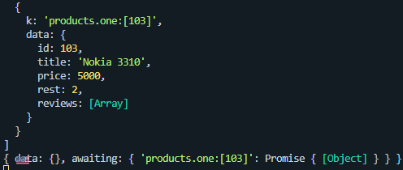

# React + TypeScript + Vite
код в server.js  
```console.log(await Promise.all(awaitingArr.map(([k, p]) => p.then(data =>({k, data})))))```  
отдает в терманале такое результат:  
<p aigin ="left"></p>  

в 20 строке server.js - техника работы с промисом "по касательной" (на самом деле then возвращает новый промис, но для нас это выглядит так как будто мы модифицируем данные предидущего промиса)

нам нужно, чтобы awaitingArr был массивом промисов (мы тут по замыканиям по зонам видимости пробрасываем ключ "k" в модификатор)
 и получается что замапеный кусочек   
 ```awaitingArr.map(([k, p]) => p.then(data =>({k, data})))```   
 это промисы,которые резолвятся вот такой структурой данных (ключем, объектом содержащим ключ, и нативные данные от базового промиса)

<p aigin ="left"></p>